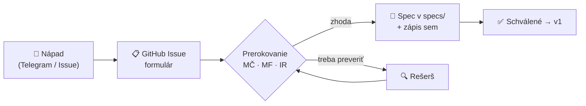

# 💡 Návrhy funkcií — evidencia

Kto čo navrhol, v akom je to stave a kde to žije

> [!TIP]
> **Chceš podať návrh?** Najjednoduchšie cez GitHub — [**Nový návrh funkcie →**](https://github.com/originalmagneto/lawOSS-like-SK-CZ/issues/new?template=feature-navrh.yml)
> Netreba nič programovať, je to formulár. Dá sa aj z mobilu. Po prerokovaní ho prepíšeme do `specs/`.

## Kto je kto

| Skratka | Meno |
|---|---|
| **MČ** | Marián Čuprík |
| **MF** | Martin Friedrich |
| **IR** | Igor Ribár |

## Evidencia návrhov

| # | Návrh | Navrhol | Dátum | Stav | Kde |
|---|---|---|---|---|---|
| 1 | Transkripcia (hovory, porady, diktát → do spisu) | **MČ** | 2026-07-29 | 📝 návrh | [spec 0001](0001-transkripcia.md) |
| 2 | OKF — operačný systém advokátskej praxe | **MČ** | 2026-07-29 | 📝 návrh · ⭐ vysoká priorita | [spec 0002](0002-okf-operacny-system-praxe.md) |
| 3 | Otvorený prompt layer (žiadny black box) | **MČ** | 2026-07-29 | 📝 návrh | [spec 0003](0003-prompt-layer.md) |
| 4 | SK MCP konektory (judikatúra, Slov-Lex, registre) | **MČ** | 2026-07-29 | 📝 návrh | [spec 0004](0004-mcp-sk-konektory.md) |
| 6 | **Attorney workflow MVP** — lehoty, conflict check, research ledger, dokumentový workflow, control plane | **MF** | 2026-07-30 | 📝 rozpracované (lehoty → spec 0005; ledger/control plane sa zlúčia do 0003/0004) | [Issue #1](https://github.com/originalmagneto/lawOSS-like-SK-CZ/issues/1) |
| 7 | **Lehoty & timeline spisu** — extrakcia lehôt s povinným potvrdením + vizuálna chronológia veci (mermaid/excalidraw) | **MF** *(+MČ timeline)* | 2026-07-30 | 📝 návrh · ⭐ kandidát na alfu #1 | [spec 0005](0005-lehoty-timeline.md) |
| 8 | **OCR ingest → markdown** — Mistral OCR quick win (existujúca Quick Action MČ), markdown-first namiesto DOCX-centrizmu | **MČ** | 2026-07-30 | 📝 návrh · quick win do alfy | [backlog](../planning/backlog.md) |
| 9 | **Orchestrátor a subagenti** — koordinácia workflowov, úzke oprávnenia, human gates a audit | **MF** | 2026-08-04 | 📝 návrh · priečna architektúra | [spec 0006](0006-orchestrator-subagenti.md) |
| 5 | **Hybrid routing** — lokálny model pre OKF, subscription pre rešerš, anonymizácia pred assessmentom | **MČ** | 2026-07-29 | 📝 na prerokovanie | [spec 0003 §hybrid](0003-prompt-layer.md#-hybrid-routing--rozdelenie-podľa-vrstvy) |

### Legenda stavov

| Stav | Význam |
|---|---|
| 💭 nápad | surový, ešte nediskutovaný (patrí do [Issues](https://github.com/originalmagneto/lawOSS-like-SK-CZ/issues)) |
| 📝 návrh | rozpísaný v `specs/`, čaká na prerokovanie |
| ✅ schválené | zhoda všetkých troch → ide do v1 |
| ⏸️ odložené | dobrý nápad, ale nie teraz |
| ❌ zamietnuté | s dôvodom (dôvod zapísať do specu) |

## Ako to funguje

1. **Nápad** hoď do Telegramu alebo rovno ako [GitHub Issue](https://github.com/originalmagneto/lawOSS-like-SK-CZ/issues/new?template=feature-navrh.yml).
2. **Prerokujeme** traja (Telegram / stretko).
3. Ak je zhoda → **rozpíše sa ako spec** v `specs/` a pridá riadok do tabuľky vyššie.
4. Autorstvo sa **vždy uvádza** — v specu aj tu. Aj pri zamietnutých návrhoch (aby sa nevracali dokola).

> [!NOTE]
> Prvý návrh mimo MČ prišiel **30. 7. 2026 od MF** cez formulár ([Issue #1](https://github.com/originalmagneto/lawOSS-like-SK-CZ/issues/1)) — presne takto to má fungovať. Igor, pridávaj rovnako, alebo napíš do Telegramu a zapíšeme to.
